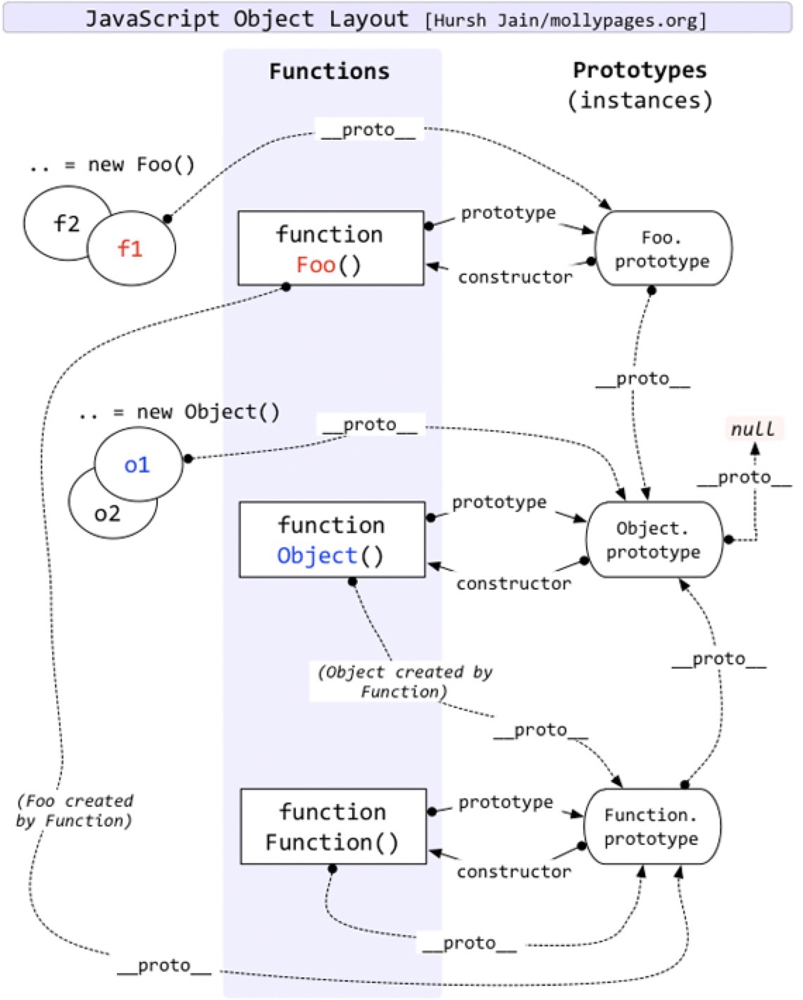

# wat i learned today

## 02/18/2016
* Atom - find matching bracket: `^-m`

## 02/19/2016
* FOUC: flash of unstyled content, "instance where a web page appears briefly with the browser's default styles prior to loading an external CSS stylesheet, due to the web browser engine rendering the page before all information is retrieved" [Wikipedia](https://en.wikipedia.org/wiki/Flash_of_unstyled_content), solution: CSS in `<head>` with `<link>`
* HTTP keep-alive: the idea of using a single TCP connection to send and receive multiple HTTP requests/responses, specifically in HTTP 1.0 [Wikipedia](https://en.wikipedia.org/wiki/HTTP_persistent_connection)

## 02/20/2016
> "The most important thing in life will always be the people in this room. Right here, right now."
> 
> Dominic Toretto

## 02/21/2016
* to use Google Chrome Canary for debugging React Native, change `google chrome` to `google chrome cacanry` in `case 'darwin': return 'google chrome';` in `./node_modules/react-native/local-cli/server/middleware/getDevToolsMiddleware.js`
* `#(single-expression)` use `%1`(`%`), `%2` for args: syntax sugar, same as `(fn (args) expressions)`

##02/22/2016
* `Function.prototype.length`: number of args expected by the funtion, replacing `arity`
* visuallly hidden (from [H5BP](https://github.com/h5bp/html5-boilerplate/blob/master/src/css/main.css))

```css
/*
 * Hide only visually, but have it available for screen readers:
 * http://snook.ca/archives/html_and_css/hiding-content-for-accessibility
 */

.visuallyhidden {
    border: 0;
    clip: rect(0 0 0 0);
    height: 1px;
    margin: -1px;
    overflow: hidden;
    padding: 0;
    position: absolute;
    width: 1px;
}

/*
 * Extends the .visuallyhidden class to allow the element
 * to be focusable when navigated to via the keyboard:
 * https://www.drupal.org/node/897638
 */

.visuallyhidden.focusable:active,
.visuallyhidden.focusable:focus {
    clip: auto;
    height: auto;
    margin: 0;
    overflow: visible;
    position: static;
    width: auto;
}
```
* `~~3.14 = 3`, any applicable usage?
* diff document load event & document ready event: ready fires when the html load has completed and the DOM is ready; load fires when image other page content have all finished loading
* DOM event delegation: a mechanism of responding to ui-events via a single common parent rather than each child, through the magic of event "bubbling" (aka event propagation) [StackOverflow](http://stackoverflow.com/questions/1687296/what-is-dom-event-delegation)

## 02/24/2016
* select `tel` protocal a: `a[href^="tel:"]`
* `rel="nofollow"`: discourage links from being followed and indexed by SE
* `<meta name="format-detection" content="telephone=no">` turn off number detection in iOS

## 02/25/2016
* 

## 02/26/2016
* Apache Hadoop’s jobtracker, namenode, secondary namenode, datanode, and tasktracker all generate logs

## 02/27/2016
* [The Life-Cycle of a Composite Component](https://github.com/facebook/react/blob/master/src/renderers/shared/reconciler/ReactCompositeComponent.js)

```javascript
/**
 * ------------------ The Life-Cycle of a Composite Component ------------------
 *
 * - constructor: Initialization of state. The instance is now retained.
 *   - componentWillMount
 *   - render
 *   - [children's constructors]
 *     - [children's componentWillMount and render]
 *     - [children's componentDidMount]
 *     - componentDidMount
 *
 *       Update Phases:
 *       - componentWillReceiveProps (only called if parent updated)
 *       - shouldComponentUpdate
 *         - componentWillUpdate
 *           - render
 *           - [children's constructors or receive props phases]
 *         - componentDidUpdate
 *
 *     - componentWillUnmount
 *     - [children's componentWillUnmount]
 *   - [children destroyed]
 * - (destroyed): The instance is now blank, released by React and ready for GC.
 *
 * -----------------------------------------------------------------------------
 */
```

## 02/28/2016
* same-origin policy: e.g. a web application using XMLHttpRequest could only make HTTP requests to its own domain
* CORS (Cross-Origin Resource Sharing): works by adding new HTTP headers that allow servers to describe the set of origins that are permitted to read that information using a web browser [HTTP access control](https://developer.mozilla.org/en-US/docs/Web/HTTP/Access_control_CORS)
* `(update-in [m [k & ks] f & args])` (Clojure): 'updates' a value in a nested associative structure, where ks is a sequence of keys and f is a function that will take the old value and any supplied args and return the new value, and returns a new nested structure. If any levels do not exist, hash-maps will be created.

```clojure
(def p {:name "James" :age 26})
(update-in p [:age] + 10)
```
* `(cons x seq)` (Clojure): returns a new seq where x is the first element and seq is the rest
`(cons [1 2] [4 5 6]) ;;=> ([1 2] 4 5 6)`
* Inside IIFE (immediate invoking function) if you use "use strict", value of this is undefined. To pass access window inside IIFE with "use strict", you have to pass this
* `window.onload` is fired when DOM is ready and all the contents including images, css, scripts, sub-frames, etc. finished loaded. This means everything is loaded; `document.onload` is fired when DOM (DOM tree built from markup code within the document)is ready which can be prior to images and other external content is loaded
* `document.readyState` returns `loading` while the Document is loading, `interactive` once it is finished parsing but still loading sub-resources, and `complete` once it has loaded; the `readystatechange` event fires on the `document` object when this value changes
* `domNode.classList.add`, `domNode.classList.remove`, `domNode.classList.toggle`, `domNode.classList.contains`
* `document.addEventListener('DOMContentLoaded', function(){});`
    
